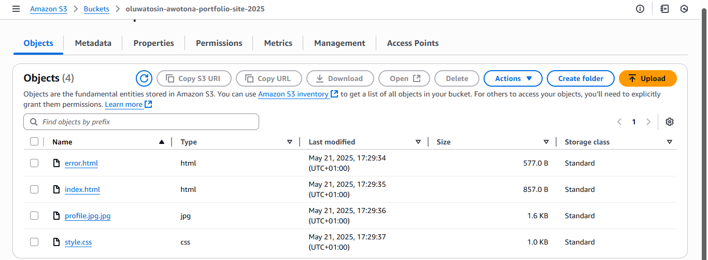
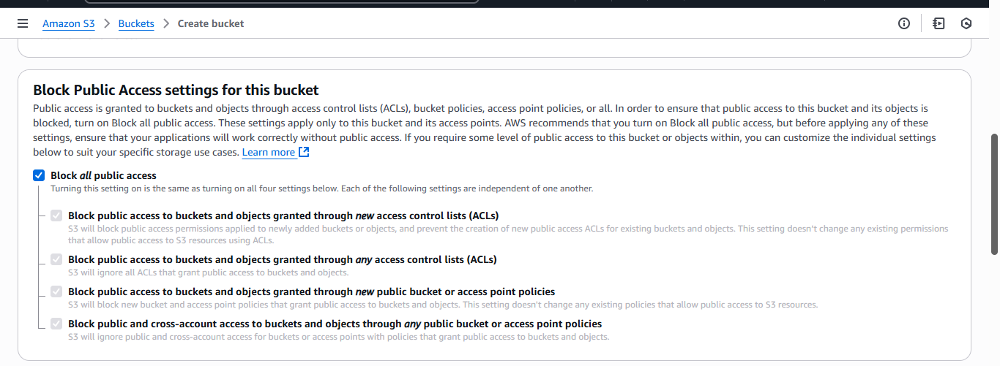

# Project: Building a Secure & High Performance Static Website on AWS

This project details my hands on journey to architect, deploy, and manage a secure, cost effective, and fast personal portfolio website using Amazon Web Services (AWS). It is a deep dive into building a robust web presence that is always available and quick to load for anyone, anywhere.

You can think of it like building a fantastic new shop. You need a place to store your goods, a way to display them, security to keep them safe, and a super efficient delivery service to get them to customers quickly, no matter where they are. That is exactly what I did, but for a website!

---

## Architectural Overview

This diagram illustrates the cloud infrastructure I designed and deployed for my portfolio website. It leverages Amazon S3 for reliable content storage and Amazon CloudFront as a Content Delivery Network (CDN) for fast, global content delivery and secure HTTPS access.

### Diagram Breakdown:
1.  **Website Visitor:** Users access the website via their web browser.
2.  **Amazon CloudFront (CDN):** All user requests first hit the CloudFront distribution. CloudFront's global network of "edge locations" caches content closer to users, reducing latency and improving loading speeds. It also provides HTTPS security for all connections.
3.  **Amazon S3 Bucket (Origin):** If CloudFront doesn't have the content cached, it fetches it from the S3 bucket. This bucket serves as the highly available and durable storage for all website assets (HTML, CSS, images). It is configured for static website hosting, managed with bucket policies for public read access, uses versioning for content recovery, and has lifecycle rules for cost optimization.

---

## Phase 1: Laying the Foundation: The Secure "Storage Room" (Amazon S3)

Every website needs a home for its files, like pictures, text, and styling instructions. In the cloud world, we use **Amazon S3 (Simple Storage Service)**.

You can imagine S3 as a giant, well organized, and very secure storage warehouse. Each "bucket" (that's what we call a storage container in S3) is like a dedicated room in this warehouse. I created a bucket named `oluwatosin-awotona-portfolio-site-2025` to hold all my website's ingredients: inclusive of my `index.html` (the main page), `error.html` (what shows if something goes wrong), `style.css` (how it looks), and my `profile.jpg` (my picture).

*Here's a look at my project files locally:*

*And setting up my S3 bucket, specifying its name and region:*

### Turning a Storage Room into a Display Room (Static Website Hosting)

The best thing about S3 is that you can tell it, "Hey, this vault isn't just for storage; it is a website!" By enabling **static website hosting** on my bucket, S3 essentially became a basic web server, ready to show off my `index.html` page to visitors.

*Configuring my bucket for website hosting, pointing to `index.html` and `error.html`:*

*After uploading my website files, they were all neatly stored in the bucket:*

### The Crucial Security Guard (Block Public Access & Bucket Policies)

When you create an S3 bucket, it is designed to be completely private by default, like a vault with no windows. This is a super important security feature called **"Block Public Access (BPA)"**. My bucket started with all its doors locked.

*Initial default security settings, blocking all public access by default:*

But for a website, we *need* people to see it! So, I had to be very precise. I had to tell S3, "I want this specific bucket to be readable by the public, but ONLY in a controlled way." This required two careful steps:
1.  **Adjusting the Main Lock:** I had to go into the bucket's BPA settings and specifically *uncheck* a couple of checkboxes. Think of this like deciding which specific doors in your vault *can* have a window added, without just throwing the whole vault wide open. This was a tricky part, as there are four checkboxes, and picking the right combination is key to balancing security and accessibility. After troubleshooting, gaining a deeper understanding of each security setting, I found the perfect balance by unchecking the third and fourth boxes.
    *The corrected security settings that allowed public access via policy:*
    
2.  **Adding the "Public View" Permission (Bucket Policy):** Once the main lock was adjusted, I then added a **Bucket Policy**. This is like a very strict instruction manual that tells S3, "Allow *anyone* (`"Principal": "*"`), but *only* to *read* (`"s3:GetObject"`) the files in *this specific bucket* (`"Resource": [...]`)." This explicit policy opened a controlled "viewing window" to my website files.
    *Applying the specific bucket policy to grant public read access:*
    

With these settings in place, my website was finally live and accessible directly from S3!
*My website, live via the S3 endpoint (before the profile image was fully integrated with CloudFront):*

---

### ⚠️ Security Note: Production Best Practices

In this project, the S3 bucket is configured for public read access to enable simple static website hosting. While this works for learning purposes, **it is not recommended for production environments.**

The best practice is to keep S3 buckets completely private and use CloudFront with **Origin Access Control (OAC)** to serve content securely. This ensures only CloudFront can access the bucket, reducing exposure and aligning with AWS security standards.

I noted this and plan to implement a private S3 + OAC configuration in future iterations as I progress into automation and infrastructure as code with tools like Terraform.

---

## Phase 2: Smart Management: The "Archivist" & "Cost Saver" (Versioning & Lifecycle Rules)

Running a website isn't just about putting files up, it is also about managing them over time. What if I accidentally delete something? Or want to revert to an older version of my website? And how do I make sure I'm not paying too much for old, unused files?

### The "Undo Button" (Versioning)

I enabled **Bucket Versioning** on my S3 bucket. This is like having an automatic "undo" button for every file. Every time I uploaded a new version of my `index.html` (for example, to update my contact info), S3 didn't just overwrite the old one. It kept a copy of the previous version. This means I can always go back in time if I need to!

*Enabling versioning for my S3 bucket:*

*After enabling versioning and uploading an updated `index.html`, I could see both versions of the file in my bucket:*

### The "Smart Archivist" (Lifecycle Rules)

To save costs and keep my storage tidy, I created a **Lifecycle Rule**. Imagine a very smart Archivist who automatically moves old documents to cheaper storage or deletes them after a certain period. My rule told S3:
* "After 30 days, move my current website files (like `index.html`) to **Glacier Instant Retrieval**, a super affordable storage class for less frequently accessed data."
* "After 365 days, permanently delete these old files (current versions)."
* "For any *previous* versions of my files (the ones I 'undid'), move them to Glacier Instant Retrieval after 60 days, and delete them completely after 180 days."

This automates cost savings and keeps my bucket litter free!

*The full lifecycle rule showing all transitions and expiration settings for current and noncurrent objects:*

---

## Phase 3: Supercharging Performance: The "Global Express Delivery" (Amazon CloudFront)

My website was live on S3, but it was sitting in just one AWS data center. If someone in, say, Germany accessed it, their request would have to travel all the way to my chosen region (US East). That takes time!

### The Global Delivery Network (CloudFront CDN)

That is where **Amazon CloudFront** comes in. Think of CloudFront as a global express delivery service. It has "edge locations" (mini warehouses) all over the world. When someone visits my website, CloudFront quickly delivers the content from the *closest* edge location, rather than making them wait for the content to travel from my original S3 bucket. This makes the website load super fast and provides a smoother experience for users everywhere.

* It also automatically provides **HTTPS** (that little padlock symbol in your browser), making the website secure for visitors, even though my S3 bucket didn't directly serve HTTPS.
* (Note: During setup, I opted to NOT enable the Web Application Firewall (WAF) to stay within the AWS Free Tier for this basic project.)

*Creating the CloudFront distribution, linking to my S3 website endpoint and setting up HTTPS redirection:*

### The Final Touch & Cleanup Confirmation

After configuring CloudFront and letting it deploy globally (which takes a little patience by the way!), I got a new, super fast web address for my website. And crucially, my profile picture was successfully served, confirming correct CloudFront integration!

*My CloudFront distribution, successfully deployed and enabled:*

*And finally, after crucial manual cleanup, confirming the CloudFront distribution was successfully deleted to avoid further costs:*

*And confirming the S3 bucket was also deleted, signifying full resource cleanup:*

---

## Challenges & Key Learnings

This project wasn't without it's own tricky moments! The biggest challenge was navigating the **Block Public Access (BPA)** settings and the **Bucket Policy**. It felt a bit like trying to unlock a complex safe, where one wrong turn could keep the doors shut. But by troubleshooting methodically and understanding how each setting interacted, I eventually got it right. This taught me the immense importance of AWS's security defaults and how to carefully configure them for specific needs.

I also learned the power of:
* **Version control:** No more fear of accidental deletions!
* **Automation:** Letting AWS manage storage tiers and deletions saves time and money.
* **Content Delivery Networks (CDNs):** Understanding how global caching dramatically improves user experience.

---

## Conclusion: A Deployed & Managed Cloud Website!

By completing this project, I have gained hands on experience deploying and managing a static website using core AWS services. I've built not just a website, but a robust, secure, and high performing web presence ready for the world. This experience has deepened my understanding of cloud infrastructure and how to apply it practically.

---

## 📂 Repository Contents
* `index.html` — Main website page
* `error.html` — Custom error page
* `style.css` — Website styling
* `profile.jpg` — Personal profile image
* `images/` — Screenshots and visual documentation for this README.md
* `README.md` — This document

---
## 📫 Connect With Me
* [Oluwatosin Awotona](https://github.com/OluwatosinAwotona) (GitHub)
* [Oluwatosin Awotona](https://www.linkedin.com/in/oluwatosinawotona/) 

---

*Building automated, precise cloud infrastructure that scales and performs.*